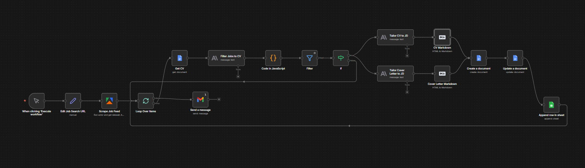
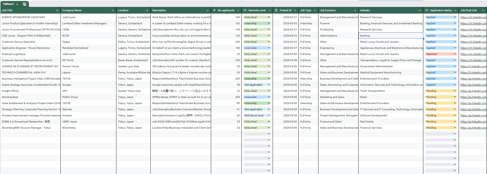

# 🤖 AI-Powered Job Search Automation

> Automated end-to-end pipeline that scrapes, filters, and applies to jobs — powered by N8N, LLMs, and Apify.

---

## 📌 What It Does

- Scrapes **LinkedIn** and **Jobs.ch** for relevant job postings automatically
- Filters 100+ postings per run using an **LLM scoring system** — only the top ~15% pass
- Generates a **tailored CV section + cover letter** for each matching job (FR / EN / IT)
- Outputs everything to a structured **Google Doc** (CV on page 1, cover letter on page 2)
- Logs all results to **Google Sheets** with a direct link to each application document

**Result: ~80% reduction in manual application time.**

---

## ⚙️ How It Works

1. **Trigger** — Daily scheduled run (or manual)
2. **Scrape** — Apify scrapes LinkedIn & Jobs.ch based on target cities and keywords
3. **Filter** — Claude Haiku scores each posting for relevance, seniority, and language match
4. **Tailor** — A dedicated node rewrites CV sections (header, summary, skills) per job
5. **Cover Letter** — Separate LLM node generates a 3-paragraph cover letter (~250 words), auto-detecting language
6. **Export** — Google Doc created per application + row logged in Google Sheets

---

## 🛠️ Stack

| Tool | Role |
|------|------|
| **N8N** | Workflow orchestration |
| **Apify** | LinkedIn & Jobs.ch scraping |
| **Claude Haiku (LLM)** | Job filtering + CV tailoring + cover letter |
| **Google Docs API** | Output document generation |
| **Google Sheets API** | Application tracking log |

---

## 📸 Screenshots

### N8N Workflow Canvas

### Google Sheets Log

---

## 📊 Key Results

- ✅ 100+ jobs scraped per daily run
- ✅ ~15% pass the LLM filter (relevant, correct seniority, right language)
- ✅ Tailored CV + cover letter generated per match
- ✅ Zero manual work after initial setup

---

## 🔒 Privacy Note

API keys, credentials, and personal data are stored as environment variables in N8N and are not included in this repository.
